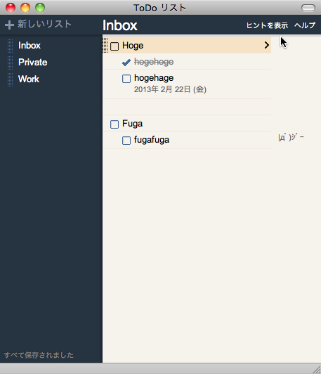

# Fluid Taskskin
Fluidでアプリ化したGoogle Tasks用のCSSスキン

## 説明
Fluidでアプリ化したGoogle Tasks。とても便利ですが、デザインが無骨でちょっと萎える…  
ならスマホ向けのページでアプリ化すれば…と思ったけど、パソコンで使うにはあのインターフェイスはムダが多い気がする…

という訳でスキン、作りました。これで安心してタスク管理できそうです。

## スクリーンショット
- 通常時  

- マウスをグレーのバーに合わせると…  

- メニューが開きます  


## 要件
- FluidでGoogle Tasksをアプリ化していること。
- その際、スマホ向けではなく、PC向けのURLでアプリ化していること。
 - https://mail.google.com/tasks/canvas  
（OK：PC向け）
 - https://mail.google.com/tasks/android  
（NG：Android向け）
 - https://mail.google.com/tasks/iphone  
（NG：iPhone向け）

## インストール方法
1. アプリ化したGoogle Tasksのパッケージの内容を表示し、「**Contents/Resources/**」に移動。
2. default.cssがあるのを確認したら、ダウンロードしたdefault.cssで上書き。
3. アプリを起動するか、既に起動していたら`Cmd+R`でリロードすれば反映されます。

## 設定
メニューを非表示にせず、開きっぱなしにもできます。
### 設定方法
1. cssファイルを開き、一番下まで移動します。
2. コメント「@group Menu」より下のクラス指定（169行目から177行目まで）をコメントアウト／削除し、保存したら完了です。

#### 設定後
```default.css
/* @group Menu */
.gb .goog-toolbar {
	height: 2px;
	overflow: hidden;
	-webkit-transition: all 0.1s ease-in-out;
}
.gb .goog-toolbar:hover {
	min-height: 27px;
	height: auto;
}
/* @end */
```

#### 設定後
```default.css
/* @group Menu */
/*.gb .goog-toolbar {
	height: 2px;
	overflow: hidden;
	-webkit-transition: all 0.1s ease-in-out;
}
.gb .goog-toolbar:hover {
	min-height: 27px;
	height: auto;
}*/
/* @end */
```

## 既知の問題
- メニュー非表示時、メニューを開いて表示を「日付順」などに変えてメニューを閉じると、下部にグレーの余白が出てしまう。  
**【対策】**  
別のリストに切り替える、またはメニューを常に表示すれば回避できます。  
**【解決案】**  
背景に画像をひけば解決できそうですが、CSS1ファイルで済ませたいので保留。

## ライセンス（License）
Copyright &copy; 2013 [tsukaguitar](http://www.rakuin.com)  
Licensed under the [MIT License][mit].


[GFM]: http://github.github.com/github-flavored-markdown/
[MIT]: http://opensource.org/licenses/mit-license.php
